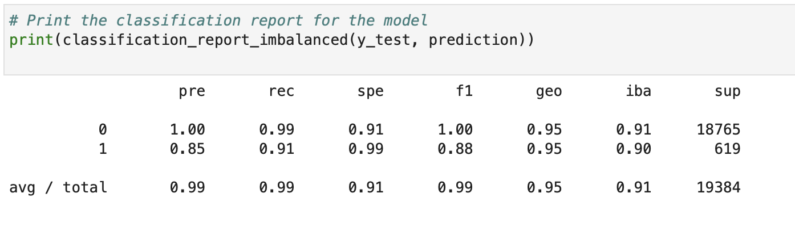
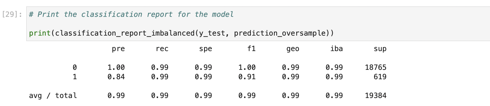

# Challenge_12

Supervised learning was used to classify and predict risky loans. Risky loans are imbalanced data set. Therefore two models was used to predict the risky loan, they are: 

- random sample logistic regression 
- oversample logistic regression 

## Random Sample logistic regression: 

This uses the original data to train the model. 

The accuray score was 0.95. Accuracy measures the model's ability to separate true cases with false cases. This suggest the model is quite 
accurate in predicting the riskiness of the loan. 

 

### Classification report for random sample logstic regression model: 

Confusion matrix provides precision and recall measures of the model. Precision refers to the portion of true positive amongst true positive and false positive. The precision score is 0.99. This suggest the model is capable of distinguish the real positive case. Recall refers to the portion of true positive amongst true positive and false negative. The recall score is 0.99. This also suggest the model is quite accurate. 

 

## Over-sample logistic regression: 

This uses the minority of the dataset and enlarge it to the same size as the majority of dataset. 

The accuracy score is 0.99. This suggest the model is relatively accurate than random sampling. This suggest over-sampling strategy is more effective for classifying imbalanced data. 

### Classification report for over-sample logstic regression model:

Confusion matrix provides precision and recall measures of the model. The precision score is 0.99. This suggest the model is capable of distinguish the real positive case. The recall score is 0.99. This also suggest the model is quite accurate. 
